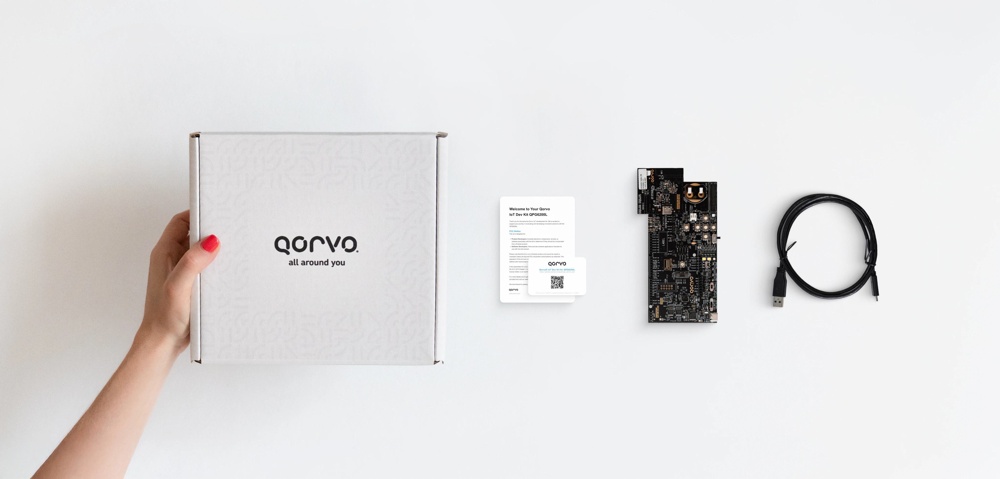

Quickstart
##########

What's in the box?
******************

The box contains:

*  Carrier Board + QPG6200 Radio Board
*  Notice and QR Code for Gitlab Access
*  USB 3.0 to USB-C cable

**We can't wait to see what you'll create with QPG6200!**

Check the Hardware
******************

Check the Hardware Development Kit for damage before you proceed further:

* Make sure the box is dry and without damage
* Check if all moisture seals are intact
* Check all contents of the box for signs of physical damage
* Examine the electronic boards and their components

.. WARNING::

   Damaged electronics can endanger you and your equipment.
   If you notice any issues - do not proceed. Do not power on the damaged device. Resolve the problem with your supplier.

Install the SDK
***************

.. admonition:: NOTE

   The build environment for this SDK requires a Linux x86_64 operating system. Instructions below are based on Ubuntu 22.04 Linux distribution.

Before you start using the Qorvo® IoT SDK, you must install and activate
the development environment. All commands used for development (e.g.,
building and programming) must be executed after activating the Qorvo®
IoT SDK. If you want to work in multiple shell sessions, you need to
activate the Qorvo® IoT SDK in each session.

To install and activate the Qorvo® IoT SDK, complete the following
steps:

1. Download or :code:`git clone` the `Qorvo® IoT SDK Gitlab Repository <https://gitlab.com/qorvo_sdk/public/devkits/qpg6200-iot-sdk>`_
2. Navigate to the top-level directory of the repository.
3. Execute the following command:

   ::

      source ./Scripts/activate.sh

Once finished, your development environment is ready for use.

.. admonition:: NOTE

   The first installation may take some time to download
   and install all the necessary tools.

Perform RF Testing
******************

For RF testing and evaluation, you can use the Product Test Component (PTC) application, our dedicated application for comprehensive RF testing and configuration. PTC offers powerful tools to validate and optimize your RF performance.

To begin RF testing, follow the steps outlined in the :doc:`Getting Started with Radio Control Console <../../Tools/RadioControlConsole/README>`.

Example Applications
********************

You can also explore example applications that come precompiled with the SDK. You can find them in the ``Binaries``
directory.

.. admonition:: NOTE

   To test precompiled applications without setting up the full development environment,
   you need Git LFS to access repository binaries:

   ::

      sudo apt-get install git-lfs
      git lfs install
      git lfs pull

   For detailed setup instructions, see the `Git LFS installation guide <https://git-lfs.github.io/>`_.

To test an example application, complete the following steps:

1. Connect your Development Kit to your PC.
2. Choose an application binary to test, e.g.,
   ``Binaries/HelloWorld/HelloWorld_qpg6200.hex``.
3. Program the device with your preferred tools. For more information
   about programming, refer to the `Programming <#programming>`__
   section of this documentation.
4. Observe the logging output of the application. For more information
   about logging, refer to the `Serial Logging <#serial-logging>`__
   section of this documentation.

Working with Examples
*********************

The Qorvo® IoT SDK includes example applications to help you start
developing your custom application. Use these examples as reference
implementations for your custom projects.

Building
********

.. admonition:: NOTE

   `Install the Qorvo® IoT SDK <#install-the-sdk>`__ before building an application.

To build an application, complete the following steps:

1. Navigate to the directory containing the example you are interested
   in.
2. Execute the ``make`` command with the appropriate Makefile. For
   example, to build the Hello World application, run:

   ::

      cd Applications/HelloWorld
      make -f Makefile.HelloWorld_qpg6200 clean
      make -f Makefile.HelloWorld_qpg6200

3. Find the generated ``hex`` file in your ``Work/HelloWorld_qpg6200/``
   directory.

Programming
***********

Connect your Development Kit to your PC using the USB cable. Your PC
should recognize the device as a standard USB drive. To program the
QPG6200, choose from one of two supported tools.

.. WARNING::

   Do NOT press the reset button during programming, as
   this might brick the device!

Programming using JLink tools
^^^^^^^^^^^^^^^^^^^^^^^^^^^^^

Programming using JLink tools is the recommended method to program your
device. Download and install the latest version of J-Link from the
`Segger website <https://www.segger.com/downloads/jlink/>`_. QPG6200
has native support in J-Link starting from version 8.10h.

After you have installed the latest J-Link Software pack, you can use
``JFlash Lite`` to program and erase your device.

.. WARNING::

   ``Update existing installation`` must be selected during
   the installation.

.. admonition:: NOTE

   Version 8.10j does not support the QPG6200 Secure Debug
   feature. If you have enabled the Secure Debug feature, you need to
   use `Qorvo Platform tools <#programming-using-qorvo-platform-tools>`_
   to open the debug and program the device. For details about Secure
   Debug, refer to the `Qorvo Platform Tools - Secure Debug  <https://qorvo_sdk.gitlab.io/public/tools/packages/qorvo-platform-tools/security_toolbox/security.html#secure-debug>`_.

.. WARNING::

   Version 8.12e is incompatible with Qorvo Platform Tools 1.3.8. Please use 8.12d or earlier until this issue is resolved.

Programming using Qorvo Platform tools
^^^^^^^^^^^^^^^^^^^^^^^^^^^^^^^^^^^^^^

Programming using ``Qorvo Platform tools`` is the second option for
programming your applications.

.. admonition:: NOTE

   Since ``Qorvo Platform tools`` provides support for
   QPG6200 devices with Secure Debug enabled, which is not yet
   officially supported by the JLink tools, you need to enable the
   support yourself. For detailed information and instructions, refer to
   `QPG6200 JLink support <../../Tools/QorvoPlatformTools/README.md#qorvo-platform-tools>`__.

For steps on how to program the application, refer to `Qorvo Platform tools <../../Tools/QorvoPlatformTools/README.md#qorvo-platform-tools>`__.

.. WARNING::

   JLink version ``8.10j`` release has a known issue where
   the Secure Element Firmware can only be upgraded, using Qorvo
   Platform Tools, after the chip is erased!

.. WARNING::

   Version 8.12e is incompatible with Qorvo Platform Tools 1.3.8. Please use 8.12d or earlier until this issue is resolved.

The ``Qorvo Platform tools`` can also be used to upgrade the Secure
Element firmware in your device. For steps on how to upgrade the Secure
Element firmware, refer to `Upgrading Secure Element firmware <https://qorvo_sdk.gitlab.io/public/tools/packages/qorvo-platform-tools/security_toolbox/secure_upgrade.html#secure-element-firmware-upgrade>`_.

Serial logging
**************

First make sure the development kit is connected to your computer using
the USB-C port on the IoT Dev Kit for QPG6200. As mentioned above, a
virtual COM port (``/dev/ttyACMx``) will be available for use.

Next you can use a serial terminal application to connect to the COM
port. In this example, we will be using Minicom. This tool can be
installed using following command:

::

   sudo apt-get install minicom

After the installation, start minicom using following options:

::

   minicom -D /dev/ttyACM0 115200

Please note that the COM port number and device label **may differ** on
your computer.

After resetting the programmed QPG6200, serial logging should be
available.

Debugging
*********

.. admonition:: NOTE

   When debugging applications that go to sleep, `enable the
   debug pins <https://qorvo_sdk.gitlab.io/public/tools/packages/qorvo-platform-tools/security_toolbox/devices.html#required-debug-connections>`_!

-  A known issue has been observed when trying to run arm-none-eabi-gdb
   with python version 3.9, it is recommended to use gdb-multiarch after
   installing it by:

   ::

      sudo apt install gdb-multiarch

1. Download and install J-Link

   Download and install the latest version of JLink from `Segger
   website <https://www.segger.com/downloads/jlink/>`_.

2. Run JLInkGDBServer:

   ::

      gnome-terminal -- JLinkGDBServer -device QPG6200 -if SWD

3. Run gdb client on second terminal:

   ::

      arm-none-eabi-gdb

   or

   ::

      gdb-multiarch

4. Connect to GDB server:

   ::

      (gdb) target remote localhost:2331

5. Program target with hex file:

   ::

      (gdb) cd Work/HelloWorld_qpg6200/
      (gdb) load HelloWorld_qpg6200.hex
      Loading section .sec1, size 0x1b0 lma 0x10020000
      Loading section .sec2, size 0xfe00 lma 0x10020200
      Loading section .sec3, size 0x365e lma 0x10030000
      Loading section .sec4, size 0xc9a0 lma 0x10033660
      Loading section .sec5, size 0xa7b8 lma 0x10040000
      Loading section .sec6, size 0x74 lma 0x1004a7c0
      Start address 0x100424ac, load size 174042
      Transfer rate: 8498 KB/sec, 11602 bytes/write.

6. Load symbol elf file:

   ::

      (gdb) symbol-file HelloWorld_qpg6200.elf
      Reading symbols from HelloWorld_qpg6200.elf...

7. Reset dev board

   ::

      (gdb) monitor reset 0
      Resets core & peripherals via SYSRESETREQ & VECTRESET bit.

8. Add breakpoint:

   ::

      (gdb) break main.c:92
      Breakpoint 1 at 0x100463a8: file Applications/HelloWorld/src/main.c, line 92.

9. Run until hits breakpoint:

   ::

      (gdb) continue
      Continuing.

      Breakpoint 1, helloWorld_Task (pvParameters=) at Applications/HelloWorld/src/main.c:92
      92              GP_LOG_SYSTEM_PRINTF("Hello world", 0);

Folder Structure
****************

Brief overview of the SDK folder structure to help you navigate the repository:

-  ``Applications/``: Source code for reference
   applications.

   -  ``Bootloader/``: Example implementation of User Mode Bootloader.
   -  ``HelloWorld/``: The smallest functional application.
   -  ``Matter/``: Matter™ examples.
   -  ``Peripherals/``: QPG6200 peripheral driver examples.
   -  ``PTC/``: Qorvo® Product Test Component (PTC) System.
   -  ``Zigbee/``: Zigbee examples.

-  ``Binaries/``: Prebuilt binaries that can be directly programmed to
   your hardware.
-  ``Documents/``: Detailed guides and API references.
-  ``Scripts/``: Scripts to set up your development environment.
-  ``Tools/``: Various tools for post-build actions, logging, memory
   analysis, and radio testing.
